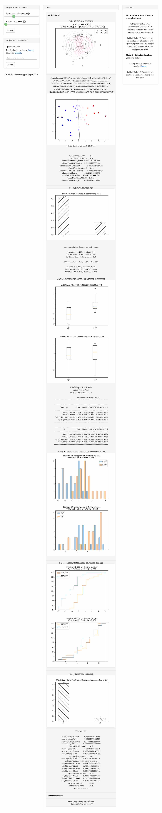

# About

This project is a GUI wrapper for pyCLAMs:  

    pyCLAMs: An integrated Python toolkit for classifiability analysis [J]. SoftwareX, Volume 18, June 2022, 101007, doi: 10.1016/j.softx.2022.101007

The original version is developed in ASP.Net MVC (http://qsi.zhangys.org.cn/research/cla/). This project has rewritten it using Flask.     

# Install and Run

1. pip install wCLAMs
   The package will be installed into USER\anaconda3\Lib\site-packages\wCLAMs 
2. python -m wCLAMs.run
    * Serving Flask app "run" (lazy loading)
    * Environment: production
      WARNING: This is a development server. Do not use it in a production deployment.
      Use a production WSGI server instead.
    * Debug mode: off
    * Running on http://0.0.0.0:5005/ (Press CTRL+C to quit)
   127.0.0.1 - - [20/Apr/2022 12:16:51] "GET / HTTP/1.1" 200 -
   WARNING: QApplication was not created in the main() thread.
   127.0.0.1 - - [20/Apr/2022 12:16:57] "POST /submit HTTP/1.1" 200 -
   127.0.0.1 - - [20/Apr/2022 12:17:03] "POST /submit HTTP/1.1" 200 -
3. Go to http://localhost:5005/

# Run directly from source

1. git clone https://github.com/zhangys11/wCLAMs.git
2. cd wCLAMs/app/
3. python wCLAMs.py
4. Go to http://localhost:5005/

# ScreenCut

